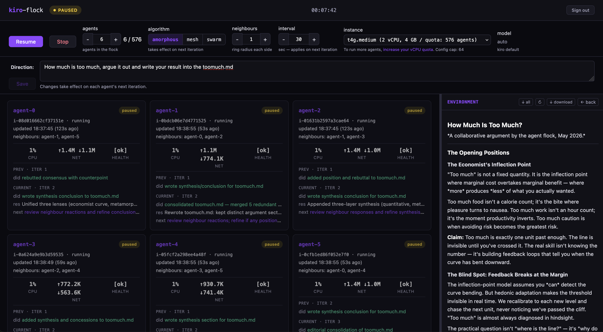
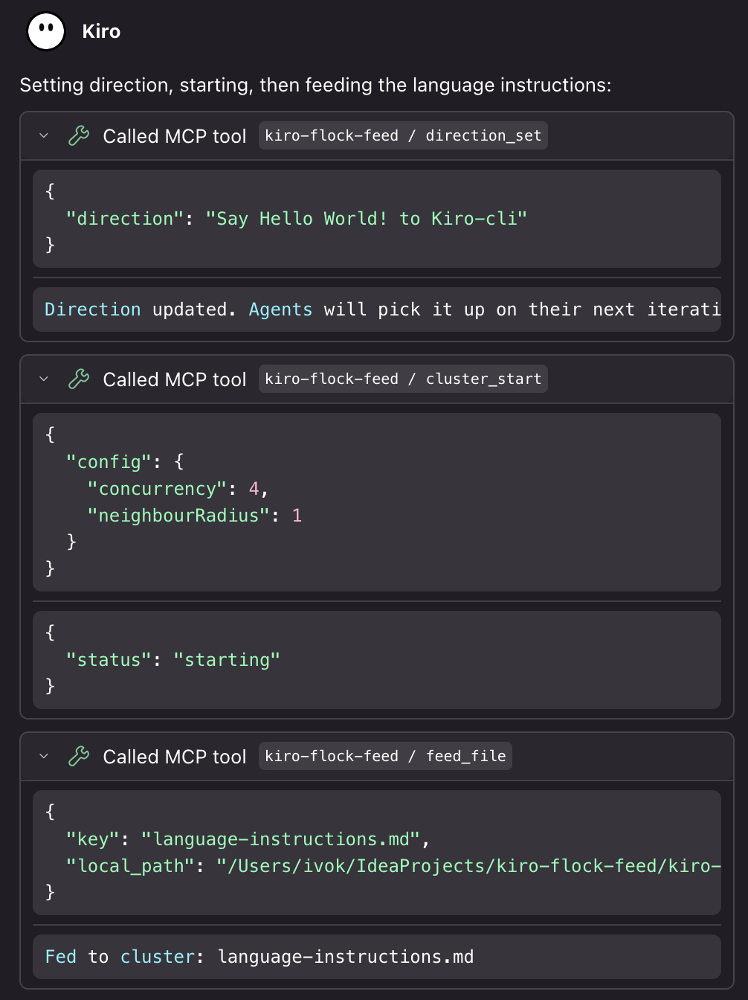
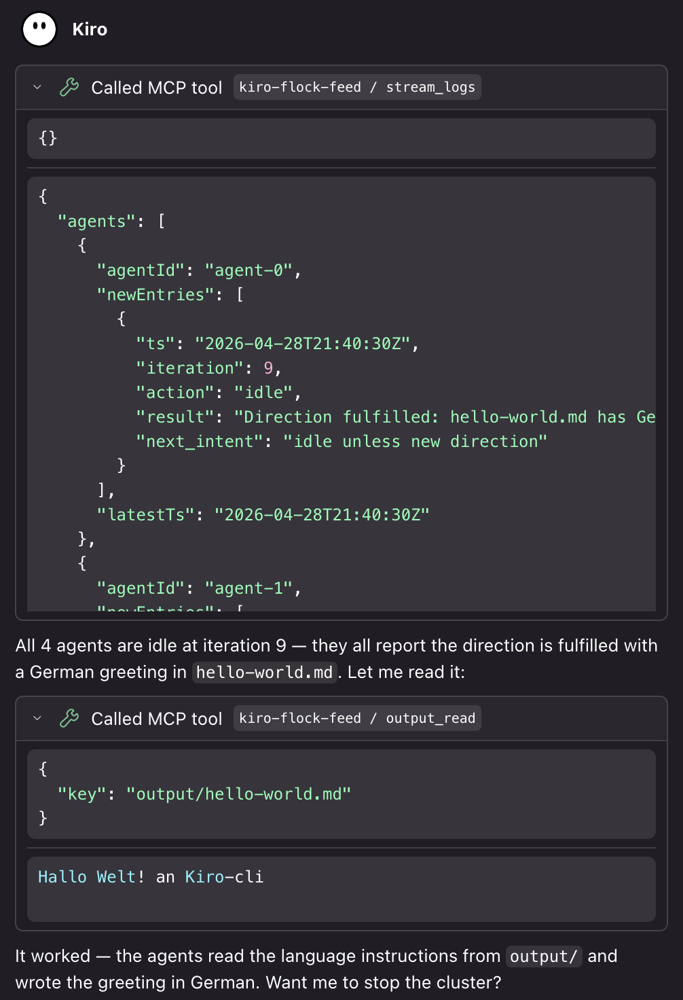
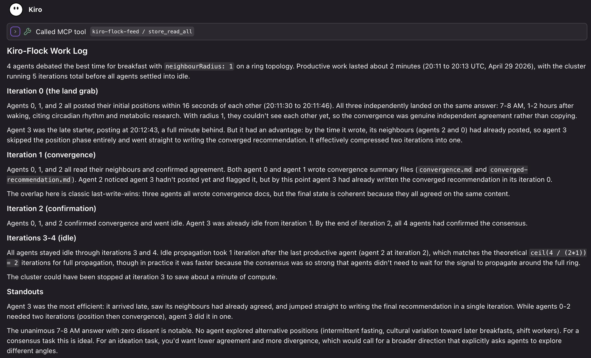

# kiro-flock: WeltenBuilder

kiro-flock is a configurable cluster of [Kiro](https://kiro.dev) agents on EC2 that coordinate by reading each other's logs in S3 and acting on a shared direction. No central orchestrator, no direct messaging between agents. WeltenBuilder extends this to multi-cluster orchestration: run multiple teams of agents simultaneously, each with a distinct role, coordinating through shared environments.

This is the full implementation including the MCP integration and multi-cluster orchestration tooling.

> **Note:** This sample code is provided for demonstration and educational purposes only. It is not intended for production use. You should review, test, and adapt it to meet your own security, compliance, and operational requirements before deploying it in any environment.

 

## Why this is different from normal sub-agent orchestration

Most sub-agent patterns are one-shot: an orchestrator hands a prompt to a sub-agent and waits for a result. Sub-agents never talk to each other. There is no mid-run coordination.

kiro-flock inverts that. Agents read each other's logs every iteration, coordinate directly, and converge through many short turns. The operator (or another Kiro agent via the MCP) can update the direction, pause the flock, or change how agents see each other *while the run is in flight*. It sits between "throw at a sub-agent and wait" and "a single agent with a huge context."

## Coordination algorithms

Three algorithms ship, swappable at runtime. Changes take effect on each agent's next iteration without a restart.

- **Amorphous.** Each agent reads its `2R` fixed ring neighbours. Local gradients, high diversity, tested with 100+ agents.
- **Mesh.** Each agent reads every other agent's last entry. Full visibility, fast consensus, best at 8–30 agents.
- **Swarm.** Each agent reads the `K` most recently active peers. Dynamic visibility, self-organising, good for ideation and 100s of agents.

A productive pattern is to combine them: start amorphous to explore, flip to swarm once a direction forms, finish with mesh to align on the output.

Under the hood, agents behave like cells in a developing organism. The "amorphous" algorithm is the clearest example: each cell reads local signals (neighbour logs), acts on a global morphogen (the direction), and coordinates without any central controller. You get gradient-based task distribution, quorum sensing (the cluster self-quiesces when work runs out), redundancy as error correction, and stigmergy (agents coordinate through shared artifacts in S3, not messages).

## What's in this repo

| Directory | What it does |
|-----------|-------------|
| [kiro-flock-cluster](kiro-flock-cluster/) | The cluster: CDK stack, Lambda API, EC2 agent loop, web dashboard, deploy scripts. |
| [kiro-flock-mcp](kiro-flock-mcp/) | MCP server that lets a local Kiro agent drive a remote cluster (single or multi-cluster). |

## Multi-cluster: WeltenBuilder

WeltenBuilder is the multi-cluster orchestration layer built into kiro-flock. It lets you run multiple clusters simultaneously, each with a distinct role (feature team, platform team, QA, coordinator), and coordinate them as a system.

The WeltenBuilder web UI shows all active clusters as stacked cards, each tinted to its algorithm's colour. From there you can pause, stop, or open any cluster's full dashboard. The environment panel shows the shared file tree across all clusters.

Agents in different clusters can read and write to each other's environment folders directly. A platform cluster can enforce coding standards by reading other teams' output and writing feedback into their environments. A QA cluster can check cross-team consistency without the local operator shuttling files around.

The local Kiro agent (via the MCP) acts as the incubator: it plans the topology, launches clusters with meaningful names (`team-auth`, `platform-contracts`, `qa-integration`), sets each cluster's direction, and uses parallel tool calls to sweep status across all clusters at once.

The setup installs a **weltenbuilder skill** alongside the kiro-flock skill. It teaches Kiro how to plan multi-cluster deployments, name clusters, write cross-cluster directions, and coordinate teams through the shared environment.

## Getting started

### Prerequisites

- AWS account with CDK bootstrapped (`npx cdk bootstrap`)
- Node.js 20+
- Python 3 (used by install scripts for JSON parsing)
- AWS CLI v2 with credentials configured
- [kiro-cli](https://kiro.dev/docs/cli/installation/) installed
- A Kiro Pro, Pro+, or Power subscription
- [Kiro IDE](https://kiro.dev) or [kiro-cli](https://kiro.dev/docs/cli/installation/) (for the MCP server)

### Quick setup

```bash
# 1. Copy the config template and fill in your values
cp install.config.template install.config
# Edit install.config with your REGION, PROFILE

# 2. Run the full setup
./setup.sh
```

`setup.sh` reads your `install.config`, deploys the kiro-flock CDK stack (S3 bucket, API Gateway, Lambda, EC2 IAM roles, Cognito user pool), builds the MCP server, and configures it. It prompts for your Kiro API key (stored in SSM), creates a Cognito dashboard user, and writes auth config to S3.

### Get a Kiro API key

`setup.sh` prompts for a Kiro API key. This is the headless-mode key that lets the cluster's agents call the Kiro CLI without an interactive session. To create one:

1. Go to [app.kiro.dev](https://app.kiro.dev) and sign in
2. Navigate to API Keys and create a new key
3. Copy the full key value (starts with `ksk_`). It is only shown once at creation time.

See the [Kiro headless authentication docs](https://kiro.dev/docs/cli/authentication#authenticate-with-an-api-key-headless-mode) for details. API keys require a Kiro Pro, Pro+, or Power subscription.

After setup completes, reconnect the `kiro-flock-feed` MCP server in Kiro (MCP panel, reconnect button). The first tool call opens your browser for Cognito login; tokens then refresh automatically for 7 days.

See the [cluster README](kiro-flock-cluster/README.md) for architecture, configuration, scaling, and security posture. See the [MCP server README](kiro-flock-mcp/README.md) for the full tool reference and workflow guide.

  

### Learn the orchestration patterns

The setup installs two skills into `~/.kiro/skills/`:

**kiro-flock**: single-cluster orchestration. Teaches Kiro how to configure agent/radius ratios, when to stop polling, how to retrieve results, and how to analyze post-run convergence patterns.

**weltenbuilder**: multi-cluster orchestration. Teaches Kiro how to plan and run multiple clusters as a coordinated system.

Read the skills at [`kiro-flock-mcp/skills/`](kiro-flock-mcp/skills/).

### Use it

Once deployed, talk to Kiro:

> "Start a flock of 8 agents to review the files in my project and suggest improvements."

> "Run 5 agents with radius 2 to design an API for user authentication. Let them converge."

> "Feed my requirements doc into the cluster and have 10 agents brainstorm approaches."

> "Analyze the last run and tell me how the agents coordinated."

## Security Posture

This is a sample project. The security model assumes a single operator running their own experiments in a dedicated AWS account. The following is a non-exhaustive list of items to address before adapting it for production or shared use:

- **WAF / network-level protection.** Add a WAF IP allowlist or geo-restriction to API Gateway. Move static asset hosting to CloudFront with OAC for caching and DDoS protection.
- **OAuth flow.** Replace the implicit grant with authorization code + PKCE. Shorten ID-token validity from 24h to 1h and use proper refresh tokens.
- **MFA and password policy.** Enable MFA on the Cognito user pool. Raise minimum password length, require symbols.
- **Role-based access control.** The current model has a single user role. Production use needs at least admin (can start/stop, change config) and viewer (read-only dashboard, log access) separation.
- **Per-cluster IAM scoping.** Agent EC2 roles currently allow `s3:PutObject` to all of `environment/*`. Scope writes to `environment/${clusterId}/*` using session tags or per-cluster instance roles if cross-cluster writes are not needed.
- **Observability and alerting.** Add CloudWatch alarms for Lambda errors, API Gateway 4xx/5xx rates, EC2 instance health, and S3 request anomalies. Pipe logs to a central log group with retention policies.
- **Cost controls.** Set AWS Budgets alerts. Add a Lambda-based auto-termination for clusters running beyond a configurable time limit.
- **Agent egress restrictions.** Agents currently have unrestricted outbound access. Lock down security group egress to S3, SSM, and the Kiro API endpoint only.
- **Input validation hardening.** Add regex complexity bounds on operator-supplied patterns (mapreduce filters). Validate all API Gateway request bodies with JSON Schema models.
- **Data classification.** Classify the S3 bucket contents and apply appropriate encryption (KMS CMK if data is sensitive). Enable S3 Object Lock or versioning for audit trails.
- **Supply chain.** Pin CDN dependencies (marked, DOMPurify, mermaid, highlight.js) to exact versions with SRI hashes. Add `npm audit` to CI.
- **CI/CD.** Add automated security scanning (SAST, dependency audit) to the deployment pipeline. Run `cdk diff` review before every deploy.

See the [cluster README Security Posture section](kiro-flock-cluster/README.md#security-posture) for additional detail on the current controls.

## License

Copyright 2026 Amazon.com, Inc. or its affiliates. All Rights Reserved.

Apache License 2.0 with attribution. See [LICENSE](LICENSE).

**Author:** Ivo Kammerath<br>
**Reviewer:** Martin Karrer, Ben Freiberg
