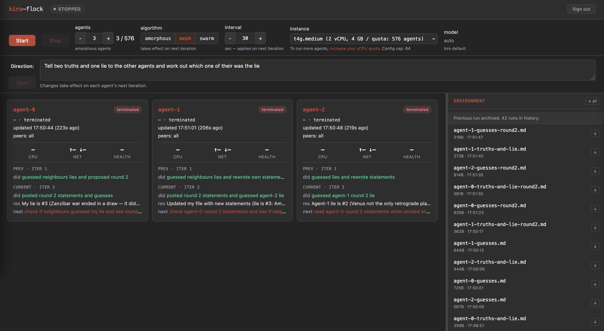
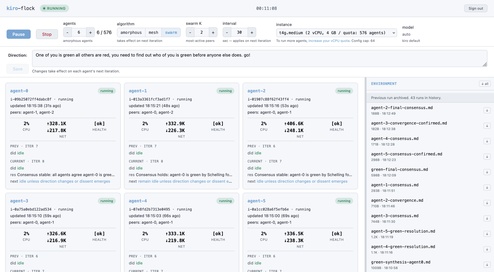
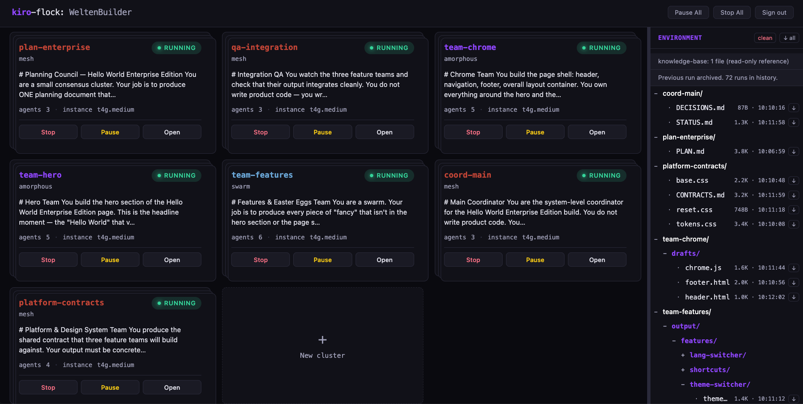
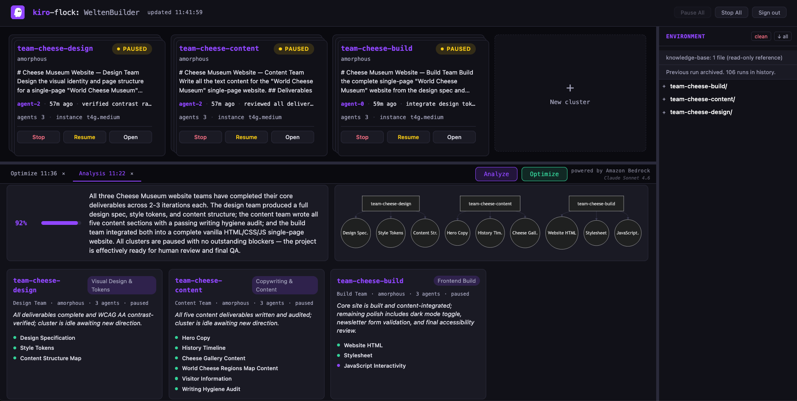
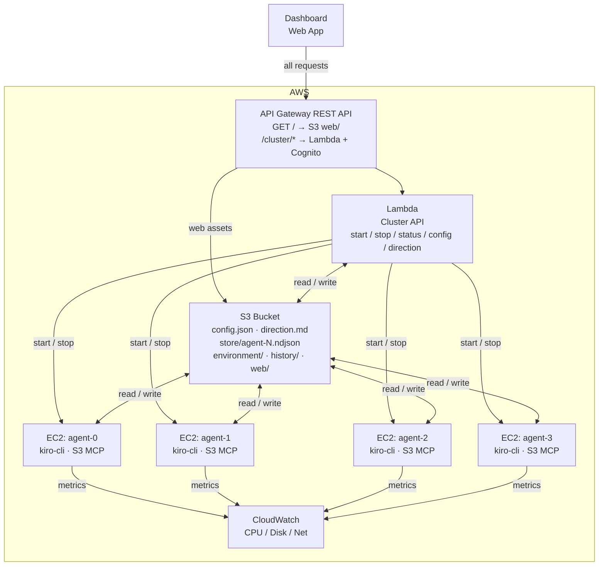

# Amorphous Generative Agents (AGA)

Kiro-flock applies amorphous computing to generative AI: a configurable cluster of [Kiro](https://kiro.dev) agents on EC2 where each agent only sees its neighbours, acts on a shared direction, and converges through local interaction. No orchestrator, no direct messaging. Web dashboard for control and live metrics.

Each agent reads its neighbours, decides what to contribute toward an operator-set direction, acts, and writes back to S3. The project demonstrates emergent coordination and task convergence in 5 to 7 iterations, using Kiro's [headless mode](https://kiro.dev/docs/cli/headless/) and [ACP](https://kiro.dev/docs/cli/acp/) on EC2.

## Why do you need this?

Normal sub-agent orchestration works on one-shot coordination: the orchestrator gives a sub-agent a prompt and waits for it to finish. This is where we differ. We have different communication patterns across the cluster during the runtime of all sub-agents, and can still orchestrate them through the MCP while they are running. So we are not reliant on one-shot and wait.

Normal sub-agents also do not talk to each other at all. They are completely on their own. Our cluster communicates with one another to coordinate each other's work.

## Applications

**Parallel map-style workloads.** A flock can split a large task across agents the way map/reduce splits data across workers. Each agent picks up a different slice of the work, processes it independently, and writes its output back to the shared environment. The results still need a review and integration pass, but the bulk of the mechanical work happens in parallel.

**Self-correcting through redundancy.** When one agent goes down a rabbit hole or hallucinates a dependency that doesn't exist, its neighbours are working from different context and won't make the same mistake. As agents read each other's logs and converge on the direction, the flock naturally corrects outliers over a few iterations. You don't need to catch every error yourself because the group dynamics do most of the filtering.

**Deliberate divergence and ideation.** Set a broad direction and let agents explore different angles on purpose. The neighbour-reading mechanism means agents build on each other's ideas without collapsing into groupthink the way a single long conversation would. Useful when you need volume of perspectives rather than depth on one, or when you're still figuring out the right approach and want to see multiple takes before committing.

**Expanding the context window.** A single agent is limited by what fits in its context. A flock of agents can research, generate, and refine in parallel, each one holding a different slice of the problem. The shared log acts as an external memory that any agent can read from. This lets you tackle work that would otherwise require careful manual chunking to fit into one session.

**Studying emergent communication.** The append-only log topology is a minimal coordination primitive. Running a flock and watching how agents develop conventions, divide labour, or fail to coordinate is interesting on its own. The project can serve as a testbed for studying how communication patterns emerge (or break down) in decentralised multi-agent systems.

**Consensus-building for design decisions.** Give agents the same problem statement and let them independently propose architectures or API designs. The convergence process surfaces which ideas survive peer review naturally, and the outliers often contain the most interesting tradeoffs.

> **Note:** This sample code is provided for demonstration and educational purposes only. It is not intended for production use. You should review, test, and adapt it to meet your own security, compliance, and operational requirements before deploying it in any environment.

## Screenshots

Dashboard in each of the three coordination algorithms. Same cluster, same dashboard, different algorithm. The colour scheme retints to match.

  

WeltenBuilder multi-cluster view. Each card is a cluster, stacked to hint at the agents underneath. Cards tint to their algorithm's colour.



Bedrock-powered analyzer. Progress bar, organigram cards, and mermaid relation diagram generated from live cluster state by Claude Sonnet 4.6.



## Architecture



**EC2 agents.** Every instance runs a Kiro agent in a loop. The agent loop drives each turn through [kiro-cli ACP](https://kiro.dev/docs/cli/acp/) (Agent Client Protocol), spawning `kiro-cli acp` as a subprocess and communicating over NDJSON/stdio. S3 access is provided by `s3Mcp.js`, a standalone MCP server that kiro-cli spawns as a subprocess. It exposes `fs_read`, `fs_write`, and `fs_list` tools backed by S3 GetObject, PutObject, and ListObjectsV2. At boot, each instance pulls `KIRO_API_KEY` from SSM Parameter Store and authenticates headlessly.

**Lambda API.** One Lambda function sits behind API Gateway. It starts and stops the cluster, aggregates status from EC2 state, agent logs, and CloudWatch metrics, and serves the config and direction documents.

**Web dashboard.** A static single-page app served from S3 through API Gateway. It polls the status endpoint, renders a panel per agent with live metrics and iteration history, and exposes the cluster controls. You must set a direction before the cluster can start.

## Design Principles

A few deliberate choices shape how kiro-flock behaves. They look like small decisions in isolation, but together they define the coordination model.

### Stigmergy: the log is the only channel

Agents never talk to each other. They coordinate entirely through traces left in a shared environment (S3). This is stigmergy, the same mechanism termites use to build mounds and ants use to find food. Each agent writes to its own append-only log and reads its neighbours' logs. The state of the shared bucket is the state of the coordination. There is no messaging layer, no broker, no orchestrator. Remove any agent, the rest keep working. Add an agent mid-run, it reads the current state and joins in. The coordination survives any individual.

This has two practical consequences. First, every behaviour you see is a function of what's in S3 at that moment. Reproducing a run is a matter of reproducing the initial state, not replaying messages. Second, scaling is bounded by S3, not by any coordination bus. S3 absorbs reads and writes at arbitrary concurrency, so the flock can grow without the coordination plane becoming a bottleneck.

### Fresh session per iteration: memoryless agents

Each iteration spawns a new `kiro-cli acp` subprocess and a new ACP session. The agent has no private memory across iterations. Its only memory is what it reads from S3 at the start of the turn: the direction, its own log, and its neighbours' logs.

This is a stance, not a limitation. Persistent sessions would give each agent a private context window of accumulated history, which is a side-channel that no other agent can see. That breaks the stigmergic model: coordination would depend on internal state rather than the shared environment, and replaying the same S3 state would no longer reproduce the same behaviour. Fresh sessions keep every coordination signal visible in the shared log. The cost is that each iteration pays a "memory load" tax (reading logs), which is also what makes the system inspectable and debuggable.

Fresh sessions also protect against behavioural drift. Long-running conversations with an LLM accumulate patterns. If the last thirty turns of a persistent session all ended in `idle`, the model's next turn is fighting against thirty prior turns of momentum. It becomes harder to leave the pattern even when the shared state says the agent should. A 50-turn session of active work has the same problem in reverse: the model resists transitioning to idle even when the work is done, producing make-work output to stay consistent with its own history. Fresh sessions have no history to be consistent with. Each turn is decided on the current shared state and nothing else.

### Idle as a terminal state, not an attractor

When the flock runs out of useful work, agents broadcast `action: "idle"` in their logs. Neighbours see this and are more likely to idle too. Quorum sensing propagates the idle state across the ring, and within a few iterations the whole cluster is quiet. This is intentional. Collective idle is the flock's way of saying "we are done." With autopause enabled (the default), the cluster pauses itself once every agent has reported idle for three consecutive iterations, so a forgotten cluster does not burn compute indefinitely. Pause is a soft stop. Instances stay alive, the operator can update direction and resume, and that matches the shape of "we've converged" better than termination.

We deliberately do not try to keep agents busy once they have decided there is nothing to do. Adding anti-idle instructions to the prompt (for example, "always try to find more work") would fight the quorum-sensing behaviour that also drives convergence. The same mechanism that lets the flock agree "we're finished with this" is the one that lets it agree "we've all converged on this answer." You don't get to keep one and not the other. If you want agents to re-engage, the right lever is to update the direction. That's a fresh global signal which invalidates the "we're done" conclusion and gives everyone something new to respond to. Until then, collective idle is a feature: the cluster auto-quiesces, the operator gets a signal that the run has settled, and the cluster waits for the next move instead of running forever.

### Ring topology with bounded visibility

Agents are arranged in a logical ring, and each only reads its `2R` nearest neighbours rather than the whole cluster. This preserves diversity. A fully connected topology would cause every agent to see every signal immediately, pulling the flock toward whatever the loudest agent said first and collapsing diversity within one or two iterations. Bounded visibility means signals propagate slowly (`ceil(N / 2R)` iterations to traverse the ring), which gives dissenting agents room to develop alternative directions before the neighbourhood locks in.

The `neighbourRadius` parameter is the main knob for tuning the convergence/diversity tradeoff. Low radius = high diversity, slow convergence, good for exploration. High radius = fast convergence, low diversity, good for consensus. See the skill documentation for the ratio tables.

### Direction as morphogen

The `direction.md` file plays the role of a biological morphogen: a shared signal that shapes behaviour across the whole population. Every agent reads it every iteration. It is the only globally-visible coordination primitive, and it is the only document an operator can change mid-run to steer the flock. Agents cannot write to it. This asymmetry is intentional: the operator sets the gradient, the flock grows along it.

### Archiving, not overwriting

On cluster start, the previous run's `store/` is archived to `history/<datetime>/`. Past work is never lost, but agent logs always begin clean. The `environment/` folder is preserved across runs so operators can reuse uploaded context; use the Clean Environment action to archive it when starting fresh. This avoids a known failure mode of stigmergic systems (hysteresis, where stale traces keep guiding agents toward old solutions) while preserving the full record for post-run analysis.

## Coordination algorithms

Amorphous computing is the default, but the cluster topology (ring of EC2 instances, S3 as coordination plane, fresh session per iteration) is independent of the coordination algorithm itself. The algorithm is just the rule for *which agents an agent reads* and *how it treats what it sees*. The platform supports three:

- **Amorphous.** Each agent reads its `2R` fixed ring neighbours, so signals propagate locally and diversity survives.
- **Mesh.** Each agent reads every other agent's last entry, so everyone sees the full picture and consensus forms fast.
- **Swarm.** Each agent reads the `K` most recently active peers, so the flock self-organises around wherever the energy is.

The rest of this section expands each one in detail.

**Amorphous.** Ring topology with bounded visibility. Each agent reads its `2R` nearest neighbours and acts on local signals. No global view. Coordination emerges through gradient propagation and quorum sensing. Good for deliberate divergence, parallel map work, and tasks where you want diversity before convergence. Slow to reach consensus at scale because signals crawl along the ring.

**Mesh.** Every agent reads every other agent's last entry every iteration. Full visibility, no locality. The neighbour radius concept disappears. Coordination becomes "here is what everyone else just said, what should I say next?" Good for fast consensus, small-to-medium clusters, and design decisions where every agent should react to the current full picture. Diversity collapses quickly because everyone pulls toward whatever got said first, and the read pattern is N² on S3 (still cheap, but noticeable at 1000 agents with 1M reads per iteration).

**Swarm.** Visibility is dynamic based on recency (or similarity), not position. Agents read the K most recently active peers, not a fixed set. No fixed topology. Behaviour borrowed from boids and particle swarms: follow the neighbours who are going somewhere. Good for exploration that self-organises around promising directions, and ideation where the interesting signal is wherever activity is clustering. Can produce hot spots where most agents converge on one subtask and ignore others, so the prompt needs a repulsion term to prevent collapse.

The difference is really about what an agent treats as signal:

| Algorithm | What agent reads | Coordination principle | Best workload |
|-----------|------------------|------------------------|---------------|
| Amorphous | Fixed ring neighbours (R hops) | Local gradients, stigmergy | Parallel map, divergent exploration |
| Mesh | Every other agent | Global awareness | Consensus, design decisions |
| Swarm | K most-active or most-similar peers | Attraction to activity | Ideation, theme discovery |

### Combining algorithms in a single run

Because algorithm and swarmK reload dynamically, you do not have to commit to one algorithm for the whole run. A productive pattern:

1. Start with **amorphous** to explore the problem space broadly. Diversity is high, agents stay independent, and outliers get room to develop.
2. Once consensus starts forming in a subset of the flock, update `direction.md` with the concrete task that emerged, then switch to **swarm** so the rest of the cluster self-organises around that direction.
3. When the run is nearly done and you need everyone aligned on the final artifact, switch to **mesh** so every agent reacts to the current full picture and the flock converges cleanly.

Each switch takes effect on the next iteration. No restart, no context loss, no redeployment.

### Algorithm scaling characteristics

Each algorithm has a different ceiling, and for a different reason:

| Algorithm | Comfortable | Possible | What caps it |
|-----------|-------------|----------|--------------|
| Mesh | 8–30 agents | up to ~50 | Per-agent context grows linearly with N. The model's context window fills up before the run completes. |
| Swarm | 20–100 agents | a few hundred (with K tuned) | Behavioural collapse onto hot spots when N grows and K stays small. Raising K mitigates but trends toward mesh. |
| Amorphous | 8–500 agents | 1000+ | Infrastructure limits only (EC2 vCPU quota, S3 request rate). No algorithmic ceiling, neighbour count is always `2R`, independent of N. |

If you need consensus on a small-to-medium cluster, pick mesh and keep N small. If you want massively parallel work, amorphous scales further than anything else. Swarm sits in the middle and is most useful when the task has emergent themes that warrant following the energy.

## Project Structure

```
cdk/
  bin/app.ts              CDK app entry point
  lib/aga-stack.ts        main stack: S3, API Gateway, Lambda, EC2 IAM, Cognito

lambda/
  handler.ts              API endpoints (start, stop, status, config, direction)
  ec2Manager.ts           RunInstances / TerminateInstances / DescribeInstances
  s3Store.ts              config and agent log read/write
  cwMetrics.ts            CloudWatch GetMetricData

agent/
  bootstrap.ts            reads config, fetches API key from SSM, starts the agent loop
  agentLoop.ts            observe → decide → act → broadcast cycle
  s3Mcp.ts                standalone MCP server: S3 read/write/list over stdio
  kiroRunner.ts           kiro-cli ACP subprocess wrapper

web/
  index.html              dashboard UI
  app.js                  status polling and panel rendering

scripts/
  install.sh              idempotent setup (CDK deploy + API key + Cognito)
  build-agent-bundle.js   compile TypeScript agent into a deployable bundle
```

## Prerequisites

- AWS account with CDK bootstrapped (`npx cdk bootstrap`)
- Node.js 20 or later
- Python 3 (used by install scripts for JSON parsing)
- AWS CLI v2 with credentials configured
- `kiro-cli` installed. See [kiro.dev/docs/cli/installation](https://kiro.dev/docs/cli/installation/).
- A Kiro Pro, Pro+, or Power subscription

## Deploy

One script does the full setup:

```bash
./scripts/install.sh
```

The script:
1. Bootstraps CDK if it has not been bootstrapped yet
2. Deploys `AgaStack` (S3, API Gateway, Lambda, EC2 IAM, Cognito)
3. Asks for your Kiro API key (create one at [app.kiro.dev](https://app.kiro.dev) under API Keys) and stores it in SSM Parameter Store
4. Creates a Cognito dashboard user (username + password)
5. Writes dashboard config to S3

## Running the Cluster

Open the dashboard at the `ApiUrl` from the CDK output. The install script prints the same URL at the end.

1. Type a direction in the **direction** field. This is what the agents work on.
2. Adjust concurrency, neighbour radius, and instance type if you want to.
3. Click **Start**.

Every agent reads the direction from S3 at the start of each turn. You can change it while the cluster is running and agents will pick up the new direction on their next iteration.

### Cluster States

The badge in the top bar shows the current cluster state:

| State | Meaning |
|-------|---------|
| **checking** | Page just loaded, waiting for the first status poll to return. Buttons are disabled. |
| **stopped** | No agent instances running. Start is available. |
| **starting** | Instances are being launched or booting. Agents haven't written their first log entry yet. |
| **running** | At least one agent has completed an iteration. The cluster is active. |
| **paused** | Instances are still up, but agents are parked between iterations. Log files stop growing until Resume is clicked. |
| **stopping** | Stop was clicked. Instances are shutting down. |

## WeltenBuilder (Multi-Cluster)

WeltenBuilder is the multi-cluster orchestration UI. It runs alongside the single-cluster dashboard at `/welten` on the same API Gateway stage.

From WeltenBuilder you can see all active clusters as stacked cards (each tinted to its algorithm's colour), pause or stop any cluster, and open its full dashboard. The shared environment panel shows the file tree across all clusters.

### Cross-cluster access

Agents can read and write to any cluster's environment folder. The S3 MCP bridge grants:
- **Read**: `environment/` (all clusters), `knowledge-base/`, own cluster's `store/`
- **Write**: `environment/` (all clusters), own cluster's `store/`
- **List**: `environment/` (all clusters), `knowledge-base/`, own cluster's `store/`

Platform teams can enforce standards across other teams, QA clusters can check cross-team consistency, and coordinator clusters can fix drift, all without the operator manually shuttling files.

### Multi-cluster API

| Method | Path | Description |
|--------|------|-------------|
| `GET` | `/cluster/list` | All registered clusters with live state |
| `POST` | `/cluster/create` | Register a new cluster (body: `{id, name, algorithm}`) |
| `DELETE` | `/cluster/delete/{id}` | Unregister a stopped cluster |
| `POST` | `/cluster/stop-all` | Terminate every non-stopped cluster |
| `POST` | `/cluster/pause-all` | Pause every running/starting cluster |
| `POST` | `/cluster/clean-env-all` | Archive all environment files (requires all stopped) |

All single-cluster endpoints (`/cluster/start/{id}`, `/cluster/config/{id}`, etc.) work with any cluster ID.

### Cluster naming

IDs must match `^[a-z0-9][a-z0-9_-]{0,30}[a-z0-9]$`. Use meaningful names: `team-auth`, `platform-contracts`, `qa-integration`, `coord-main`. The `name` field in the registry is a display label shown on the cards.

## S3 Bucket Structure

One S3 bucket holds all shared state. It is the only channel between the Lambda API, the EC2 agents, and the dashboard.

```
config.json              Cluster configuration (concurrency, instance type, model, etc.)
direction.md             The goal you set. Every agent reads it at the start of each turn.

store/
  agent-0.ndjson         Append-only iteration log for agent 0
  agent-1.ndjson         Append-only iteration log for agent 1
  ...                    One file per agent, written only by that agent

environment/
  <filename>             Files produced by agents during the current run.
                         Agents write here freely. The dashboard shows this as "environment".

history/
  2026-04-23T07-15-00/   Snapshot of a previous run, created automatically on Start
    store/               Agent logs from that run
    environment/         Environment files from that run

web/
  index.html             Dashboard static assets served through API Gateway
  app.js

knowledge-base/
  <filename>             Optional reference material for agents. Drop files here
                         and agents can read them during their loop.
```

### Lifecycle

- **On Start.** The Lambda archives `store/` into `history/<datetime>/` so agent logs begin clean. The `environment/` folder is preserved across runs so operators can reuse uploaded context. To archive environment files, use the Clean Environment action (dashboard button or `POST /cluster/clean-env/{id}`).
- **During a run.** Agents append to their own `store/agent-N.ndjson` and write freely to `environment/`. They never touch another agent's log.
- **On Stop.** Instances are terminated. Logs and environment files stay in place until the next Start.
- **direction.md.** Never archived. It persists across runs. Update it from the dashboard Save button.

## API

| Method | Path | Description |
|--------|------|-------------|
| `POST` | `/cluster/start` | Launch EC2 agents |
| `POST` | `/cluster/stop` | Terminate all agent instances |
| `POST` | `/cluster/pause` | Park the cluster between iterations without terminating instances |
| `POST` | `/cluster/resume` | Unpark a paused cluster so agents continue their loop |
| `GET` | `/cluster/status` | Agent states, logs, metrics, cluster health |
| `GET` | `/cluster/config` | Read current config |
| `PUT` | `/cluster/config` | Update config |
| `GET` | `/cluster/direction` | Read current direction |
| `PUT` | `/cluster/direction` | Update direction |
| `GET` | `/cluster/habitat` | List files agents wrote to environment/ |
| `GET` | `/cluster/habitat/file` | Read a single environment file (pass `?key=`) |
| `GET` | `/cluster/instance-types` | Available Graviton instance types and vCPU quota |

## Configuration

`config.json` in S3:

```json
{
  "concurrency": 8,
  "neighbourRadius": 1,
  "instanceType": "t4g.medium",
  "loopIntervalSeconds": 30,
  "model": null,
  "algorithm": "amorphous",
  "swarmK": 4,
  "autopause": true
}
```

`concurrency` sets the number of EC2 agents. `neighbourRadius` controls how many neighbours each agent watches in the ring topology (1 = immediate left and right). `model: null` uses the default Kiro model.

`algorithm` selects the coordination strategy (see "Coordination algorithms" above): `amorphous` (ring neighbours at radius R, the default), `mesh` (every other agent), or `swarm` (K most recently active agents, picked by S3 LastModified). `swarmK` sets the peer count for `swarm` and is ignored by the other two. Both fields reload dynamically, so changing them on a running cluster takes effect on each agent's next iteration.

`loopIntervalSeconds` also reloads dynamically: running agents re-read `config.json` between iterations and apply the new value on the next sleep. `neighbourRadius` reloads too (it only changes which neighbours are selected, not the topology). Everything else (`concurrency`, `instanceType`, `model`) only takes effect on the next cluster start, since changing them mid-run would require topology or process changes.

`autopause` is on by default. When every agent has reported `action: "idle"` for three consecutive iterations, the cluster pauses itself. Instances stay alive; the operator updates direction and hits Resume. Turning it off gives you a confirm prompt because a cluster left running unattended will keep billing.

## Scaling

The default concurrency cap is **64 agents**. Two limits apply independently and both must be satisfied before you can start a larger cluster.

**Concurrency cap.** A hard limit enforced in the Lambda handler. Change it by editing `CONCURRENCY_CAP` in `cdk/lib/aga-stack.ts` and redeploying:

```ts
// cdk/lib/aga-stack.ts
environment: {
  ...
  CONCURRENCY_CAP: '128',
},
```

Then redeploy:

```bash
npx cdk deploy AgaStack --require-approval never
```

**EC2 vCPU quota.** AWS accounts have a default on-demand vCPU quota. The dashboard shows the per-instance-type agent limit derived from this quota next to each instance type in the picker. To run more agents than your quota allows, request an increase:

1. Open [Service Quotas → EC2 → Running On-Demand Standard instances](https://console.aws.amazon.com/servicequotas/home/services/ec2/quotas/L-1216C47A)
2. Click **Request increase at account level**
3. Enter the vCPU count you need (agents × vCPUs per instance type, e.g. 128 agents on `t4g.medium` = 256 vCPUs)

Quota increases are typically approved within a few hours, though larger requests can take longer. AWS recommends requesting increases in advance.

### Scale findings: convergence vs cluster size

The `neighbourRadius` that works at 8 agents does not work at 1000. The ring topology means a signal takes `ceil(N / 2R)` iterations to traverse the full ring, which grows linearly with N at fixed R. Consensus takes roughly 2–3 times that (competing versions emerge at different ring positions and need enough overlap to average out). Some worked examples:

| Agents (N) | Radius (R) | r/n ratio | Full-ring propagation | Rough consensus time | Realistic use |
|------------|-----------|-----------|----------------------|---------------------|---------------|
| 8 | 1 | 0.125 | 4 iterations | 5–7 iterations | Default. Works for most tasks. |
| 8 | 3 | 0.375 | 2 iterations | 5–7 iterations | Fast consensus on small clusters. |
| 100 | 2 | 0.02 | 25 iterations | 60–75 iterations | Parallel map. Avoid consensus tasks. |
| 500 | 4 | 0.008 | 63 iterations | 150–190 iterations | Parallel map or sharded analysis. No consensus. |
| 1000 | 4 | 0.004 | 125 iterations | 300+ iterations | Pure parallel work or wide divergent exploration. Do not expect consensus. |
| 1000 | 20 | 0.02 | 25 iterations | 60–75 iterations | Real consensus at 1000, but each agent reads 40 neighbours per iteration. Context window and read cost scale accordingly. |

**At 30 s cadence, 125 iterations is over an hour.** So a 1000-agent ring at radius 4 needs >60 minutes for a signal to even reach every agent, and several hours before any group consensus could plausibly form. This is fine if you are doing massively parallel independent work (1000 reviews, 1000 translations, 1000 shards of a corpus) where consensus is not the goal. It is not fine if you are trying to get 1000 agents to agree on a single design.

**Rules of thumb for picking radius at large N:**

- For parallel map work, keep radius small (4–8). Diversity is a feature.
- For consensus at large N, radius needs to scale roughly with `N / (2 × acceptable_iterations)`. Hitting consensus in 30 iterations on 1000 agents requires `R ≈ 17`.
- Radius never needs to exceed `N/2`. Beyond that you have full connectivity and lose all locality benefits.
- Watch the agent's context window. At radius 20 each agent reads 40 neighbour logs per iteration. Long runs accumulate history in each log, and the model's context fills up quickly.

**Current design target.** The platform is engineered so that 100–500 agents is comfortable and 1000 is achievable. The API and dashboard are designed to scale well beyond that, but cluster-wide consensus at 1000 is not a realistic workload on the current ring topology. Massively parallel work at 1000 is.

## Access Control

The API Gateway is protected by Cognito authentication on all `/cluster/*` endpoints. Static assets (`/`, `/{proxy+}`, `/welten/{proxy+}`) are served without authentication since they only contain the client-side app shell; all data access requires a valid Cognito token.

For additional network-level protection in shared environments, consider adding a WAF IP allowlist or moving static hosting behind CloudFront with OAC.

## Security Posture

This is a sample project. The security model assumes a single operator on a single IP running their own experiments. Before adapting it for broader use:

- The API is protected by Cognito authentication on all `/cluster/*` endpoints. Static asset routes are unauthenticated (they serve the app shell only). For broader use, add a WAF IP allowlist or move static hosting to CloudFront.
- Validate and allowlist `instanceType` values. Concurrency is capped at 64 by default (configurable via `CONCURRENCY_CAP` in the CDK stack).
- Agent IAM is scoped to specific S3 prefixes (`store/`, `environment/`, `knowledge-base/`). Writes to `web/`, `agent/`, `history/`, `config.json`, and `direction.md` are explicitly denied. The S3 MCP server enforces the same prefix allowlist as a second layer.
- Agent egress is unrestricted. For production, restrict outbound traffic and pin the `kiro-cli` install version.
- Treat `direction.md` as untrusted input to the fleet. Agents act on whatever it says.
- The dashboard escapes all S3-sourced data (keys, file content) and uses `dataset` attributes with `addEventListener` instead of inline event handlers to prevent XSS.
- Lambda: the cluster API function has a 120-second timeout, uses the Node.js 20 managed runtime, and has no function URL or public endpoint outside API Gateway. The start endpoint invokes itself asynchronously to avoid the API Gateway 29-second integration limit. Reserved concurrency is not set (single-operator use), but should be configured for shared accounts.
- CloudWatch: agent instances publish CPU, disk, and network metrics. These are readable by anyone with `cloudwatch:GetMetricData` in the account. For shared accounts, scope metric access using IAM conditions on the `aga/` namespace.
- SSM Parameter Store: the Kiro API key is stored as a `SecureString` parameter encrypted with the default AWS-managed KMS key. EC2 agents have `ssm:GetParameter` scoped to the `/aga/kiro-api-key` parameter only.
- IAM policies are reviewed before each deployment via `cdk diff`. The Lambda's `RunInstances` permission is conditioned on Graviton instance types and the AGA VPC subnet.
- S3 data is encrypted at rest (SSE-S3) and in transit (TLS enforced via bucket policy). Server access logs are written to a dedicated logging bucket. Data stored in the bucket is not classified; this needs classification before adoption.

### Risk Assessment

| Risk | Likelihood | Impact | Mitigation |
|------|-----------|--------|------------|
| Runaway EC2 spend from high concurrency | Low | High | Concurrency capped at 64 (configurable). Instance types restricted to Graviton t/c/m/r families. vCPU quota enforced by AWS. |
| API key exfiltration from EC2 instance | Low | High | Key stored in SSM SecureString, written to chmod 600 env file, xtrace suppressed during fetch. Not in systemd unit or cloud-init log. |
| Prompt injection via direction.md | Medium | Medium | Documented as untrusted input. Agents operate in a sandboxed S3 prefix with explicit deny on sensitive paths. No shell access from agent loop. |
| XSS via agent-written output files | Low | Medium | All S3-sourced content escaped before rendering. Markdown renderer escapes HTML before applying patterns. No inline event handlers. |
| Unauthorized API access | Low | High | Cognito authentication on all /cluster/* endpoints. Static asset routes are unauthenticated but contain no sensitive data. |
| Agent egress to arbitrary endpoints | Medium | Low | Documented as known limitation. Agents only need S3 and Kiro API. Restrict security group outbound rules for tighter control. |
| Path traversal on file read endpoint | Low | Medium | Key must start with `environment/` and must not contain `..`. |

## License

Copyright 2026 Amazon.com, Inc. or its affiliates. All Rights Reserved.

Apache License 2.0 with attribution. See [LICENSE](../LICENSE).

**Author:** Ivo Kammerath<br>
**Reviewer:** Martin Karrer, Ben Freiberg
